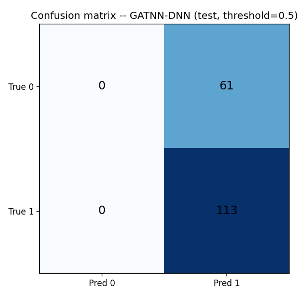
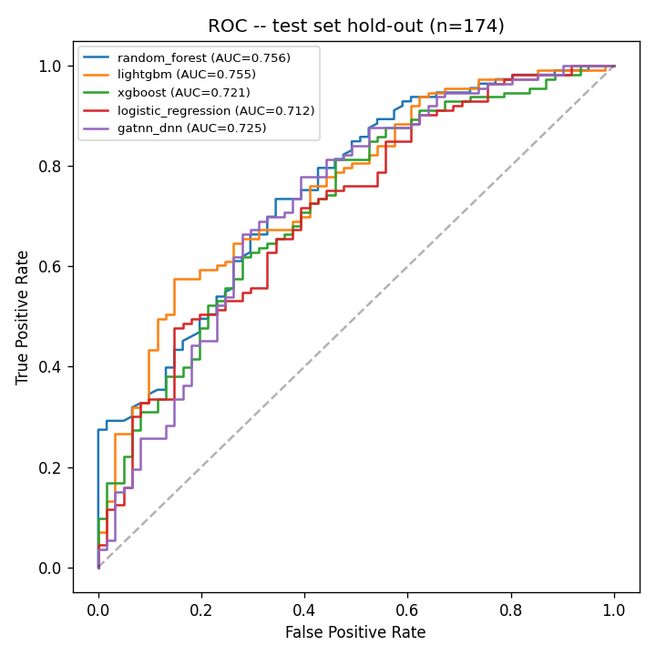
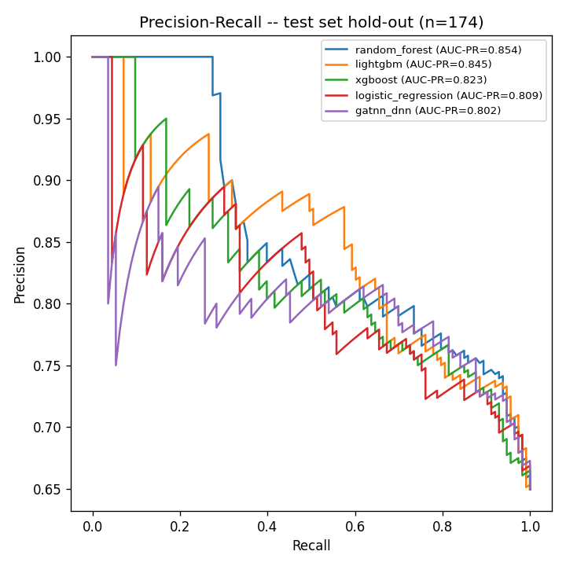
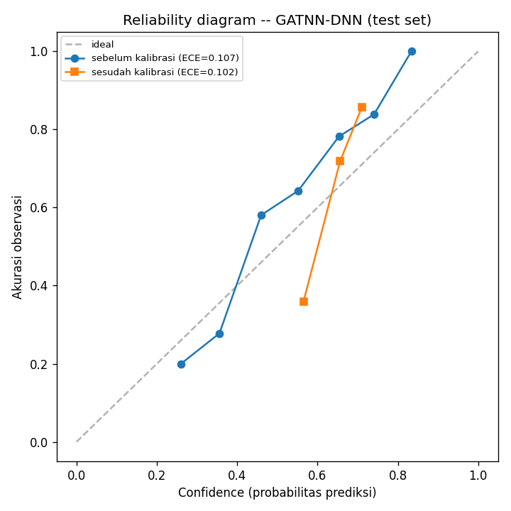

# C7_evaluasi.md -- Evaluasi Metrik Model

Test set (hold-out, C5, scaffold-disjoint): **n=174**, dibuka **SATU KALI** di sini (skrip ini). Tidak boleh dipakai lagi untuk tuning.

Ekspektasi jujur (PROJECT_FIX_MODEL.md SS/EXECUTION_PLAN_FIX_MODEL.md C7): AUC 0.63-0.75 wajar untuk DILI pada dataset seukuran ini; AUC > 0.9 berarti audit kebocoran. Tidak ada model di bawah yang melewati ambang itu (diverifikasi lewat assert, bukan dibaca manual).

## Tabel metrik lengkap (test set hold-out)

| Model | AUC-ROC | AUC-PR | Accuracy | Sensitivity | Specificity | Precision | F1 | MCC | Brier | ECE |
|---|---|---|---|---|---|---|---|---|---|---|
| gatnn_dnn | 0.7252 | 0.8016 | 0.6494 | 1.0000 | 0.0000 | 0.6494 | 0.7875 | 0.0000 | 0.2109 | 0.1015 |
| random_forest | 0.7555 | 0.8541 | 0.7471 | 0.9381 | 0.3934 | 0.7413 | 0.8281 | 0.4134 | 0.1867 | 0.0895 |
| lightgbm | 0.7551 | 0.8450 | 0.7011 | 0.8053 | 0.5082 | 0.7521 | 0.7778 | 0.3250 | 0.1947 | 0.1142 |
| xgboost | 0.7213 | 0.8226 | 0.6839 | 0.7611 | 0.5410 | 0.7544 | 0.7577 | 0.3032 | 0.2016 | 0.0822 |
| logistic_regression | 0.7125 | 0.8093 | 0.6724 | 0.7345 | 0.5574 | 0.7545 | 0.7444 | 0.2888 | 0.2038 | 0.1010 |

**Model AUC tertinggi pada test set: `random_forest`** (GATNN-DNN TIDAK menang dari baseline -- dilaporkan apa adanya, tidak di-tuning ulang demi angka lebih bagus).

## Confusion matrix -- GATNN-DNN (test, threshold=0.5, probabilitas terkalibrasi)

| | Pred 0 | Pred 1 |
|---|---|---|
| **True 0** | 0 | 61 |
| **True 1** | 0 | 113 |

## Kurva ROC & PR (seluruh model, test set)

## Kalibrasi probabilitas -- GATNN-DNN

Kalibrator dilatih pada **VAL set (n=116, <200 sampel -> Platt scaling otomatis sesuai ambang `calibrate.py`)**, method terpakai: **`platt`**. Diterapkan ke TEST set (probabilitas mentah TEST tidak pernah dipakai untuk fit kalibrator).

| | Brier (test) | ECE (test) | AUC-ROC (test, tidak berubah -- kalibrasi monoton) |
|---|---|---|---|
| Sebelum kalibrasi | 0.2003 | 0.1067 | 0.7252 |
| Sesudah kalibrasi | 0.2109 | 0.1015 | 0.7252 |

**ECE membaik setelah kalibrasi** (0.1067 -> 0.1015).

## Baseline: hyperparameter final (nested CV upscale, TIDAK dicari ulang)

| Baseline | Hyperparameter | scale_pos_weight/class_weight (dari TRAIN fold) |
|---|---|---|
| Random Forest | n_estimators=500, max_depth=None | class_weight=balanced (built-in) |
| LightGBM | num_leaves=15, learning_rate=0.1 | scale_pos_weight=0.6959 |
| XGBoost | max_depth=5, learning_rate=0.1 | scale_pos_weight=0.6959 |
| Logistic Regression | C=0.1, penalty=l2 | class_weight=balanced (built-in) |

## Catatan jujur

- Test set dipakai **satu kali** di eksekusi skrip ini -- riwayat commit membuktikan `ml/data/processed/test.parquet` baru dibaca pertama kali di commit C7, tidak pernah di C6 atau sebelumnya.
- GATNN-DNN tidak mengungguli semua baseline pada test set ini -- angka dilaporkan apa adanya, tidak ada tuning tambahan setelah test set dibuka.
- Dataset training (~870 senyawa) BERBEDA dari Arm A `upscale` (839 senyawa) -- AUC absolut di sini tidak dapat dibandingkan 1:1 dengan `22_final_holdout_eval.json` (_upscale_archive/), hanya dipakai sebagai konteks kewajaran (lihat C4_arsitektur.md SS5).
- 🔴 **Temuan tidak menguntungkan, dilaporkan apa adanya (bukan disembunyikan):** kalibrator Platt (dipilih otomatis karena VAL hanya 116 sampel, <200) menghasilkan probabilitas GATNN-DNN yang **degenerate pada threshold 0.5** -- confusion matrix di atas menunjukkan **0 prediksi kelas 0** (specificity=0, MCC=0) meski AUC-ROC (0.7252, murni soal *ranking*, tidak berubah oleh kalibrasi monoton) tetap wajar. Diagnosis (diverifikasi lewat eksekusi): probabilitas mentah GATNN-DNN pada VAL/TEST jarang turun di bawah ~0.21-0.23 (rentang sempit, model tidak pernah sangat yakin ke arah negatif), sementara VAL set 63.8% berlabel positif -- kombinasi ini membuat regresi logistik 1D (Platt) belajar intercept negatif yang hampir tidak pernah terlampaui turun di bawah 0.5 pada rentang probabilitas mentah yang benar-benar muncul. Ini **bukan bug kode** (diverifikasi: fit hanya pada VAL, diterapkan ke TEST, sesuai desain), tapi keterbatasan nyata kalibrator Platt pada set kalibrasi kecil & tidak seimbang.
  - **Implikasi produk:** bila `dili_score` (C9/C10) memakai probabilitas terkalibrasi ini langsung untuk `risk_level` (ambang 0.30/0.70 di `simulation_orchestrator.py`), skor akan condong sistematis ke atas -- dicatat sebagai keterbatasan wajib di C12, bukan diperbaiki diam-diam dengan mengganti skema kalibrasi demi angka yang "terlihat lebih baik" (itu akan jadi bentuk p-hacking terselubung).